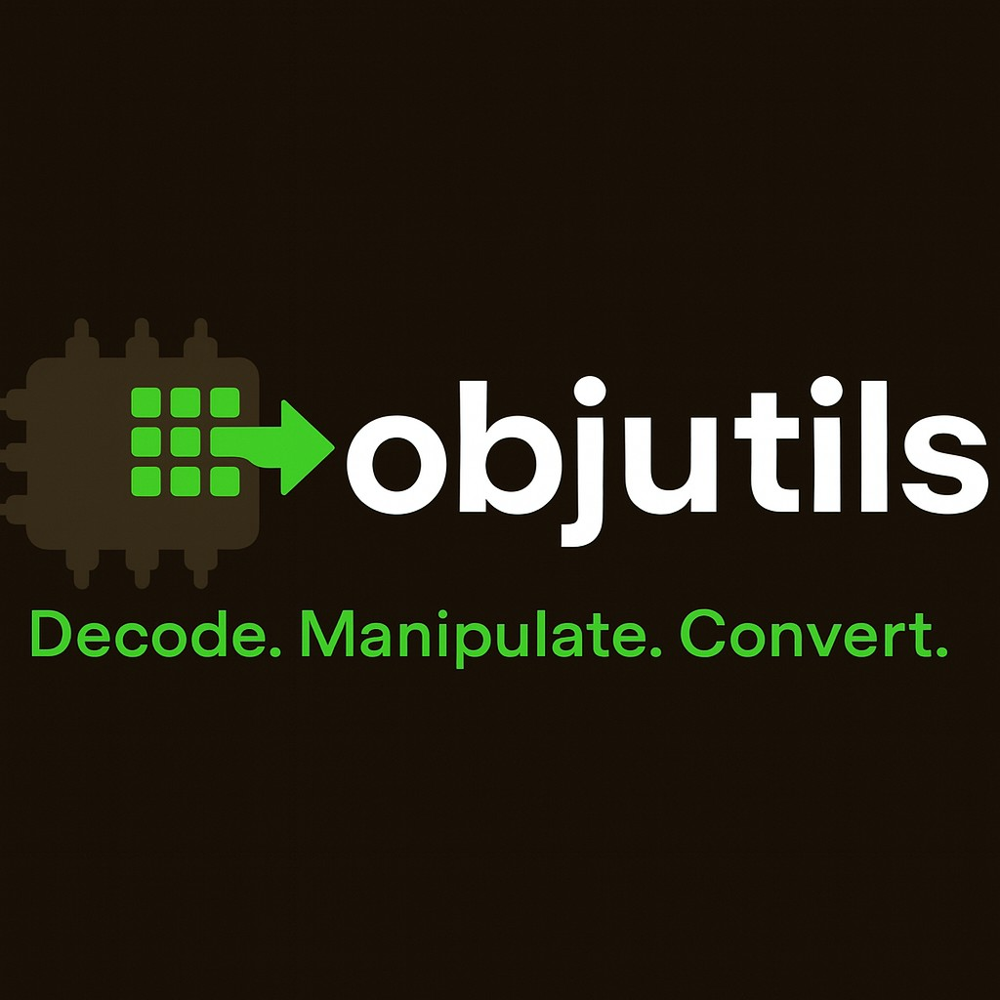

Welcome to objutils
===================

objutils provides Python APIs and CLI tools to work with object files and classic HEX/record formats used in embedded firmware workflows. Start with the tutorial and scripts, or jump to the full API reference.

.. toctree::
   :maxdepth: 2
   :caption: Contents:

   README
   installation
   tutorial
   howto
   scripts
   modules

Indices and tables
==================

* :ref:`genindex`
* :ref:`modindex`
* :ref:`search`
